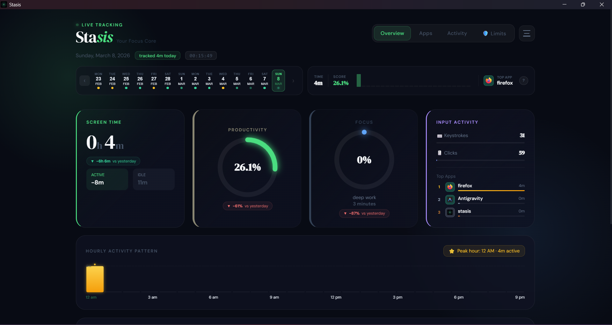
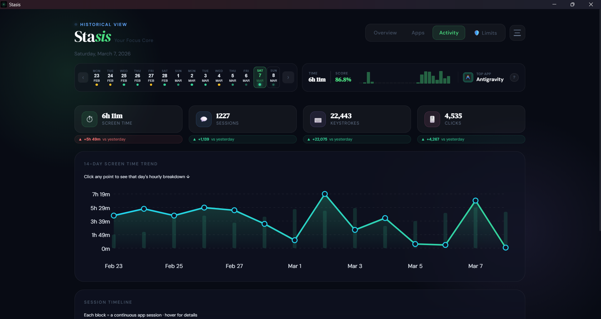
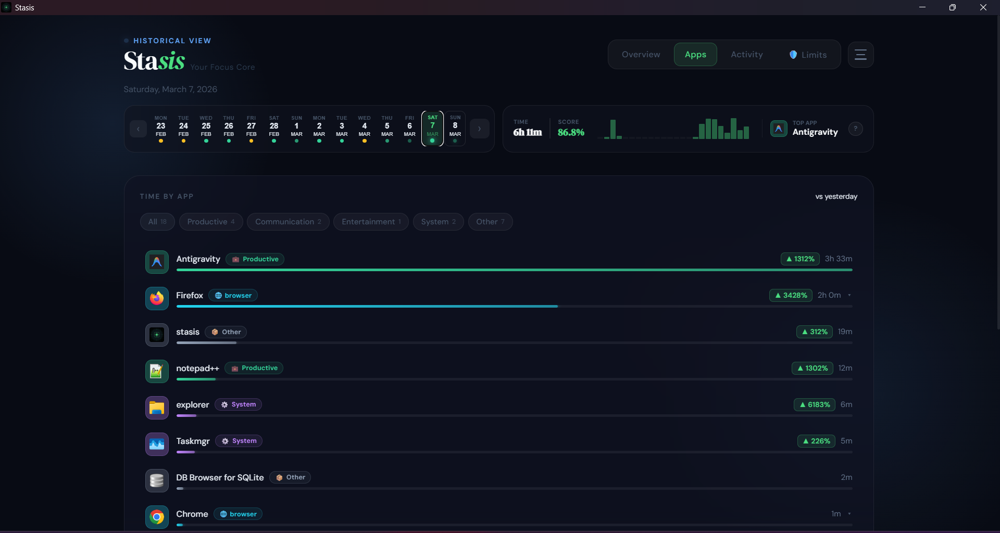
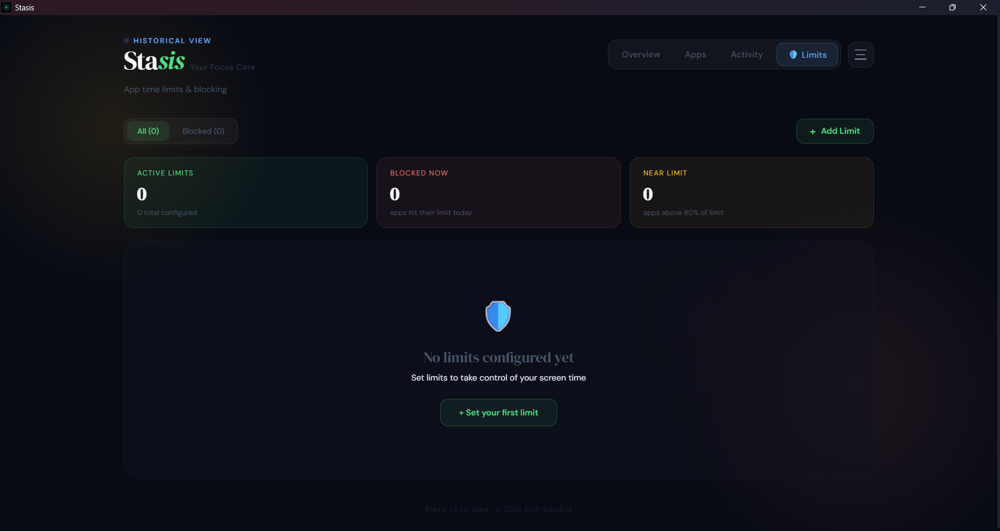
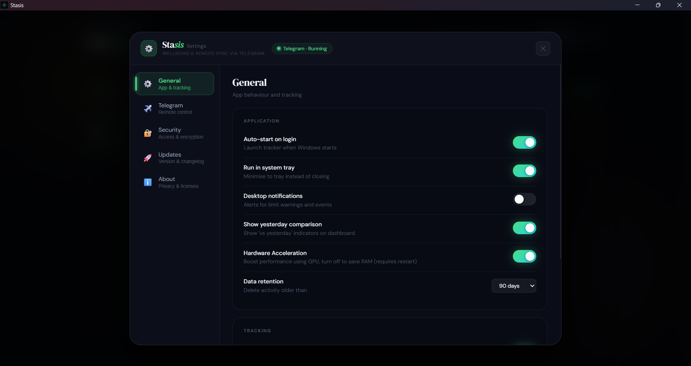
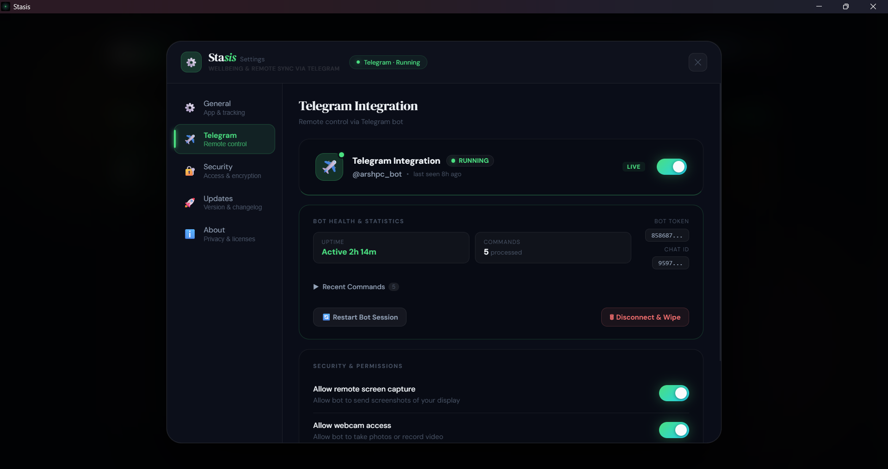

<div align="center">
  <h1>🚀 Stasis</h1>
  <p><b>Digital Wellbeing &amp; Productivity Tracker for Windows</b></p>
  <p>
    <a href="https://github.com/arshsisodiya/Stasis/releases/latest"></a>
    <a href="https://github.com/arshsisodiya/Stasis/blob/master/installer/license.txt"></a>
    
    
    
    
  </p>
  <p><i>A privacy-first, fully local screen-time tracker, focus scorer, app blocker, and Telegram remote-control tool — all in one lightweight Windows desktop app.</i></p>
</div>

---

## 📑 Table of Contents

1. [Overview](#-overview)
2. [Screenshots](#-screenshots)
3. [Features](#-features)
4. [Architecture](#-architecture)
5. [Installation](#-installation)
6. [Configuration](#-configuration)
7. [Developer Setup & Build](#-developer-setup--build)
8. [API Reference](#-api-reference)
9. [Database Schema](#-database-schema)
10. [File Structure](#-file-structure)
11. [Telegram Integration](#-telegram-integration)
12. [App Limits & Blocking](#-app-limits--blocking)
13. [Focus Scoring](#-focus-scoring)
14. [Data Retention & Privacy](#-data-retention--privacy)
15. [Privacy Policy](#-privacy-policy)
16. [Ethical & Legal Notice](#-ethical--legal-notice)

---

## 🔍 Overview

**Stasis** is a lightweight, privacy-first digital wellbeing application for Windows. It runs silently in the background and provides:

- **Real-time screen-time tracking** — knows which app has focus, for how long, and how actively you were using it (keystrokes + mouse clicks).
- **Productivity & focus scoring** — a configurable weighted formula rates your day from 0–100, considering deep-work streaks, engagement, and switch penalties.
- **Weekly report studio** — compare weeks, inspect hourly productivity heatmaps, track goals impact, and export/share weekly summaries.
- **App limit enforcement** — set daily time budgets per application; Stasis automatically terminates processes once limits are exceeded, with optional temporary unblocks.
- **Telegram remote control** — receive boot notifications, take screenshots, lock/shut down your PC, and pull activity logs from anywhere in the world via a private Telegram Bot.
- **Goals + notifications** — define daily targets, track streaks, and receive actionable Windows notifications with snooze/extend actions for limits.
- **Optional file system monitoring** — track file creations, modifications, and deletions across all drives.
- **Automatic self-updates** — checks GitHub Releases for new versions and installs them silently.

All data is stored locally in a SQLite database at `%LOCALAPPDATA%\Stasis\data\stasis.db`. Nothing leaves your machine unless you explicitly request it through Telegram.

---

## 📸 Screenshots

<div align="center">
  
  <br><br>
  
  <br><br>
  
  <br><br>
  
  <br><br>
  
  <br><br>
  
</div>

---

## ✨ Features

### 📊 Activity Tracking
| Feature | Details |
|---|---|
| **Active Window Logging** | Captures the foreground application name, executable path, and window title every second. |
| **URL Tracking** | Detects the active URL inside Chrome, Firefox, Edge, Opera, and Brave using accessibility APIs. |
| **Keystroke & Click Counting** | Counts keystrokes and mouse clicks per session to measure engagement intensity (KPM). |
| **Idle Detection** | Monitors `GetLastInputInfo` to subtract AFK time; idle threshold is configurable. |
| **App Categorisation** | Each executable is mapped to a category (`productive`, `entertainment`, `communication`, etc.) via a user-editable JSON file with URL-level rule overrides. |
| **Ignored Processes** | A configurable list of system processes (e.g., `dwm.exe`, `svchost.exe`) are filtered from all reports. |

### 📈 Analytics & Insights
| Feature | Details |
|---|---|
| **Daily Dashboard** | Per-app screen time, category breakdown, hourly bar chart, and top-app badge. |
| **Weekly Reports** | Mon-Sun reports with trend cards, app/category insights, goals progress, and week-over-week deltas. |
| **Hourly Activity Heatmap** | 7x24 weekly heatmap showing intensity and productivity mix per hour. |
| **60-Day Heatmap** | Calendar view colour-coded by relative usage intensity and productivity percentage. |
| **Session Timeline** | Chronological list of every focus window with timestamps, durations, and categories. |
| **Focus Score (0–100)** | Weighted formula: deep-work seconds + flow bonus (≥20-min streaks) + engagement score − switch penalty − idle penalty. |
| **Productivity %** | Percentage of active time spent in `productive`-category apps, weighted by keystroke intensity. |
| **14-Day Weekly Trend** | Line chart of daily screen time and productivity over the past two weeks. |
| **Goals Correlation** | Weekly insight layer showing productivity on goal-met vs non-met days with drift alerts. |
| **Website Statistics** | Top domains visited, ranked by time spent, filterable by browser. |
| **Sparklines** | Lightweight 7–30-day mini charts for screen time, focus, keystrokes, and clicks. |

### 🚫 App Limits & Blocking
| Feature | Details |
|---|---|
| **Daily Time Budget** | Set a per-app daily limit in seconds. |
| **Automatic Enforcement** | `BlockingService` checks usage every 15 s; once a limit is exceeded the process is added to `blocked_apps` and terminated within 0.5 s. |
| **Enable / Disable Toggle** | Pause a limit without deleting it. |
| **Temporary Unblock** | Override a block for a configurable number of minutes (stored as an expiry timestamp). |

### 📱 Telegram Remote Control
| Feature | Details |
|---|---|
| **Encrypted Credentials** | Bot token and Chat ID are stored encrypted with Fernet symmetric encryption. |
| **Secure Long-Polling** | Connects via the Telegram Bot API; no inbound ports required. |
| **Remote Commands** | See [Telegram Commands](#telegram-commands) table below. |
| **Service Lifecycle** | Start, stop, and restart the Telegram service independently from the UI. |

### 🗂 File System Monitoring
| Feature | Details |
|---|---|
| **Optional Feature** | Disabled by default; toggled from Settings. |
| **Watchdog Observer** | Monitors all connected drives for `created`, `modified`, `deleted`, and `renamed` events. |
| **Essential-Only Mode** | Restricts logging to Documents, Desktop, and Downloads to reduce noise. |

### 🔄 Automatic Updates
- Checks `https://api.github.com/repos/arshsisodiya/Stasis/releases/latest` for new versions.
- Downloads, extracts, and restarts the application silently.
- Manual trigger available from the Settings → Updates panel.

---

## 🏗 Architecture

Stasis uses a **dual-process architecture**: a Python telemetry engine (compiled to a standalone `.exe`) and a React/Tauri desktop UI.

```
┌─────────────────────────────────────────────────────────────────┐
│  Tauri Shell  (Rust + WebView2)                                  │
│  ┌──────────────────────────────────────────────────────────┐   │
│  │  React 19 Frontend  (Vite)                               │   │
│  │  WellbeingDashboard → Overview / Activity / Apps /       │   │
│  │                        Insights (Goals, Limits, Reports)  │   │
│  └─────────────────────┬────────────────────────────────────┘   │
│                         │  HTTP  localhost:7432                  │
└─────────────────────────┼───────────────────────────────────────┘
                          │
┌─────────────────────────▼───────────────────────────────────────┐
│  Python Backend  (Flask / Werkzeug)                              │
│                                                                  │
│  ┌──────────────┐  ┌──────────────┐  ┌──────────────────────┐   │
│  │ ActivityLogger│  │BlockingService│  │  TelegramService     │   │
│  │  (pynput)    │  │  (psutil)    │  │  (long-polling)      │   │
│  └──────┬───────┘  └──────┬───────┘  └──────────────────────┘   │
│         │                  │                                      │
│  ┌──────▼──────────────────▼──────────────────────────────────┐  │
│  │             SQLite  (WAL mode)   stasis.db                 │  │
│  │  activity_logs · daily_stats · app_limits · blocked_apps   │  │
│  │  file_logs · settings                                      │  │
│  └────────────────────────────────────────────────────────────┘  │
└─────────────────────────────────────────────────────────────────┘
```

### Thread Model

| Thread | Purpose | Restart on crash |
|---|---|---|
| `ActivityLoggerThread` | Win32 window-focus hook + input listener | Yes (daemon) |
| `APIServerThread` | Flask/Werkzeug HTTP server on 127.0.0.1:7432 | Yes (daemon) |
| `DataRetentionThread` | Purges old records every 6 hours | Yes (daemon) |
| `FileMonitorController` | Watchdog observer (optional) | Managed separately |
| `BlockingService._limit_monitor` | Checks usage vs limits every 15 s | — |
| `BlockingService._process_guard` | Terminates blocked processes every 0.5 s | — |

---

## 🚀 Installation

### Download (Recommended)

Download the latest NSIS installer from the [Releases page](https://github.com/arshsisodiya/Stasis/releases/latest):

```
Stasis-<version>-setup.exe
```

Run the installer (requires administrator privileges for a per-machine install). Stasis will be added to Windows startup automatically on first run.

### Requirements

- **Windows 10 / 11** (64-bit)
- **WebView2 Runtime** — downloaded automatically by the installer if not present
- *(Optional)* A Telegram Bot Token and Chat ID for remote control

---

## ⚙ Configuration

### Settings stored in SQLite (`settings` table)

| Key | Type | Default | Description |
|---|---|---|---|
| `telegram_enabled` | bool | `false` | Whether the Telegram service should start on boot |
| `telegram_token` | str (encrypted) | — | Fernet-encrypted Telegram Bot token |
| `telegram_chat_id` | str (encrypted) | — | Fernet-encrypted Telegram Chat ID |
| `file_logging_enabled` | bool | `false` | Enable file system monitoring |
| `file_logging_essential_only` | bool | `false` | Restrict file logging to key folders |
| `show_yesterday_comparison` | bool | `true` | Show yesterday delta in Apps page |
| `hardware_acceleration` | bool | `true` | WebView2 GPU acceleration |
| `browser_tracking` | bool | `true` | Track URLs inside browsers |
| `idle_detection` | bool | `true` | Subtract idle time from screen time |
| `data_retention_days` | int | `0` (forever) | Auto-delete activity older than N days |

### App Categories (`src/config/app_categories.json`)

Stasis categorises apps using a two-level taxonomy: `main_category` and `sub_category`.

**Main categories:** `productive`, `communication`, `entertainment`, `system`, `neutral`, `social`, `unproductive`, `other`

```jsonc
{
  "apps": {
    "code.exe":       { "main": "productive",     "sub": "development" },
    "chrome.exe":     { "main": "neutral",         "sub": "browser"     },
    "discord.exe":    { "main": "communication",   "sub": "chat"        },
    "vlc.exe":        { "main": "entertainment",   "sub": "video"       }
  },
  "url_rules": {
    "github.com":           { "main": "productive",     "sub": "development"  },
    "youtube.com/watch":    { "main": "entertainment",  "sub": "video"        },
    "mail.google.com":      { "main": "communication",  "sub": "email"        }
  }
}
```

URL rules override app rules when a browser is in focus. Wildcard patterns (e.g., `*.github.com`) are supported.

### Ignored Processes (`src/config/ignored_apps.json`)

System processes that should never appear in activity reports:

```json
{
  "ignore_processes": [
    "dwm.exe", "explorer.exe", "svchost.exe", "SearchHost.exe", ...
  ]
}
```

### Startup Config (`installer/config.template.json`)

```json
{
  "ui_mode": "normal",
  "startup_delay": 15,
  "logging": { "level": "info" }
}
```

`startup_delay` (seconds) is how long the Python backend waits after Windows boot before it begins logging — useful to avoid bogging down PC launch.

---

## 💻 Developer Setup & Build

### Prerequisites

| Tool | Version | Purpose |
|---|---|---|
| Python | 3.11+ | Backend engine |
| PyInstaller | latest | Compile backend to `.exe` |
| Node.js & npm | 20+ | Frontend build |
| Rust (stable) | via rustup | Tauri shell |
| NSIS | latest | Windows installer |
| UPX *(optional)* | latest | EXE compression |

### 1 · Clone

```bash
git clone https://github.com/arshsisodiya/Stasis.git
cd Stasis
```

### 2 · Backend only (fastest iteration)

```bash
python -m venv venv
venv\Scripts\activate
pip install -r requirements.txt
python src/main.py
```

The Flask API will start on `http://127.0.0.1:7432`.

### 3 · Full production build (Tauri + Python)

From PowerShell in the project root:

```powershell
.\build.ps1 -Version 1.2.3
```

`build.ps1` performs the following steps automatically:

| Step | Action |
|---|---|
| **1** | Syncs the version string into `tauri.conf.json`, `package.json`, and `Cargo.toml` |
| **2** | Generates `file_version_info.txt` for Windows EXE metadata |
| **3** | Runs PyInstaller using `stasis-backend.spec` → `dist/stasis-backend/` (onedir) |
| **4** | Copies the backend directory to `frontend/src-tauri/bin/stasis-backend/` |
| **5** | Runs `npm install` inside `frontend/` |
| **6** | Runs `npm run tauri:build` (Vite + Rust + NSIS bundling) |

**Output artifacts:**

```
dist/
  stasis-backend-v<version>.zip          # Standalone backend directory (zipped)
frontend/src-tauri/target/release/bundle/
  nsis/
    Stasis-<version>-setup.exe           # Full installer
    Stasis-<version>-setup.nsis.zip      # Portable ZIP
```

### Frontend development server

```bash
cd frontend
npm install
npm run dev          # Vite dev server on http://localhost:5173
```

> **Note:** The frontend expects the Python backend to be running on port 7432. Start `python src/main.py` first.

### Linting

```bash
cd frontend
npm run lint         # ESLint 9
```

---

## 🔌 API Reference

The Python backend exposes a local REST API on **`http://127.0.0.1:7432`**. All endpoints accept and return JSON. The `?date=YYYY-MM-DD` query parameter selects a historical day; omitting it defaults to today.

### Health

| Method | Endpoint | Description |
|---|---|---|
| GET | `/api/health` | Returns `{"status": "running"}` |

### Dashboard & Analytics

| Method | Endpoint | Query params | Description |
|---|---|---|---|
| GET | `/api/dashboard` | `?date=` | Daily summary: per-app screen time, hourly chart, top app, category totals |
| GET | `/api/wellbeing` | `?date=` | Productivity % and aggregate daily metrics |
| GET | `/api/focus` | `?date=` | Focus score (0–100) with breakdown: deepWorkSeconds, flowBonus, engagementScore, switchPenalty, idlePenalty |
| GET | `/api/daily-stats` | `?date=` | Per-app breakdown with active/idle seconds, keystrokes, clicks, and category |
| GET | `/api/available-dates` | — | List of all dates that have recorded activity (DESC order) |
| GET | `/api/heatmap` | — | Last 60 days: `{date: {screenTime, productivityPct}}` |
| GET | `/api/sessions` | `?date=` | Chronological list of activity log entries for the day |
| GET | `/api/weekly-trend` | — | Last 14 days: `[{date, screenTime, productivityPct}]` |
| GET | `/api/hourly` | `?date=` | 24-element array of active minutes per hour |
| GET | `/api/hourly-stats` | `?date=` | Top 3 apps per hour `{"HH": [{app, active}]}` |
| GET | `/api/site-stats` | `?date=&app=` | Top 50 domains by time: `[{domain, seconds, minutes}]` |
| GET | `/api/spark-series` | `?days=7` | Last N days aggregate: screenTime, productivityPct, focusScore, keystrokes, clicks, inputActivity |

### System & Apps

| Method | Endpoint | Description |
|---|---|---|
| GET | `/api/ignored-apps` | List of ignored process names |
| GET | `/api/app-icon/<app_name>` | PNG icon for the given executable (cached in `%LOCALAPPDATA%\Stasis\icons\`) |
| GET | `/api/system/apps` | Combined list of apps from activity history + Windows registry |

### Settings

| Method | Endpoint | Body | Description |
|---|---|---|---|
| GET | `/api/settings` | — | Returns tracking, UI, notifications, and weekly-report preference state |
| POST | `/api/settings/update` | `{key: value, ...}` | Update one or more settings; notifies FileMonitor of changes instantly |
| POST | `/api/settings/notifications/test` | — | Send a general Windows notification test |
| POST | `/api/settings/notifications/test-goal` | — | Send a goal-threshold notification test |
| POST | `/api/settings/notifications/test-limit` | — | Send an app-limit notification test with actions |
| GET | `/api/settings/notifications/history` | `?limit=20` | Recent in-app notification history |
| GET | `/api/settings/notifications/action/<action>` | query-based | Trigger action handlers (`open-goals`, `snooze-limit`, `extend-limit`, etc.) |
| POST | `/api/settings/data-retention` | `{"days": N}` | Set auto-delete threshold (0 = forever) |
| POST | `/api/settings/data-retention/cleanup` | — | Trigger immediate cleanup of expired records |
| POST | `/api/settings/browser-tracking` | `{"enabled": bool}` | Toggle URL tracking inside browsers |
| POST | `/api/settings/idle-detection` | `{"enabled": bool}` | Toggle idle-time subtraction |

### Goals

| Method | Endpoint | Query/Body | Description |
|---|---|---|---|
| GET | `/api/goals` | — | List configured goals |
| POST | `/api/goals` | goal payload | Create a new goal |
| PUT | `/api/goals/<goal_id>` | partial goal payload | Update target, label, or active state |
| DELETE | `/api/goals/<goal_id>` | — | Delete a goal |
| GET | `/api/goals/progress` | `?date=YYYY-MM-DD` | Daily goal performance snapshot |
| GET | `/api/goals/history` | `?days=30` | Goal trend/history rollup |

### Weekly Reports

| Method | Endpoint | Query/Body | Description |
|---|---|---|---|
| GET | `/api/weekly-report` | `?week_of=YYYY-MM-DD&verbosity=compact|standard|detailed` | Full weekly report payload |
| GET | `/api/weekly-report/compare` | `?week_a=YYYY-MM-DD&week_b=YYYY-MM-DD` | Two-week compact comparison with deltas |
| GET | `/api/weekly-report/available-weeks` | — | Available Monday-start week options |
| POST | `/api/weekly-report/send-telegram` | `{"week_of":"YYYY-MM-DD"}` | Send rendered weekly report to Telegram |
| GET | `/api/hourly-activity` | `?week_of=YYYY-MM-DD` | Weekly hourly activity grid used by heatmap |
| GET | `/api/limit-events` | `?start=YYYY-MM-DD&end=YYYY-MM-DD` | Limit-hit/edit event history |

### App Limits & Blocking

| Method | Endpoint | Body | Description |
|---|---|---|---|
| GET | `/limits/all` | — | All limits with `{app_name, daily_limit_seconds, is_enabled, unblock_until}` |
| POST | `/limits/set` | `{"app_name": "...", "daily_limit_seconds": N}` | Create or update a daily limit |
| POST | `/limits/toggle` | `{"app_name": "..."}` | Toggle enable/disable for a limit |
| POST | `/limits/unblock` | `{"app_name": "...", "minutes": N}` | Temporarily unblock app for N minutes |
| POST | `/limits/reblock` | `{"app_name": "..."}` | Immediately force an app back into blocked state |
| POST | `/limits/delete` | `{"app_name": "..."}` | Remove a limit entirely |
| GET | `/limits/blocked` | — | Currently blocked apps with `{app_name, blocked_at}` |

### Telegram

| Method | Endpoint | Body | Description |
|---|---|---|---|
| GET | `/api/telegram/status` | — | Lightweight status: `{enabled, running, state}` |
| GET | `/api/telegram/config` | — | Masked credentials + last 10 commands |
| GET | `/api/telegram/full-status` | — | Combined status + config in one request |
| POST | `/api/telegram/validate` | `{"token": "..."}` | Validate a bot token without storing it |
| POST | `/api/telegram/enable` | `{"token": "...", "chat_id": "..."}` or `{}` | First-time setup or re-enable existing credentials |
| POST | `/api/telegram/disable` | — | Stop the bot service (credentials preserved) |
| POST | `/api/telegram/restart` | — | Restart the bot service |
| POST | `/api/telegram/reset` | — | Permanently wipe all stored credentials |

### Danger Zone

| Method | Endpoint | Required header | Description |
|---|---|---|---|
| DELETE | `/api/clear-data` | `X-Confirm-Clear: yes` | Delete all activity and daily-stats records |
| DELETE | `/api/factory-reset` | `X-Confirm-Reset: RESET_ALL` | Wipe database, reset settings, restart app |

### Updates

| Method | Endpoint | Description |
|---|---|---|
| GET | `/api/update/status` | Update manager state: `{state, current_version, latest_version, ...}` |
| POST | `/api/update/check` | Start async update check against GitHub Releases |
| POST | `/api/update/install` | Start async download and install of the latest release |

---

## 🗄 Database Schema

Stasis uses **SQLite with WAL mode** at `%LOCALAPPDATA%\Stasis\data\stasis.db`.

```sql
-- Raw telemetry (one row per tracked focus window)
CREATE TABLE activity_logs (
    id              INTEGER PRIMARY KEY AUTOINCREMENT,
    timestamp       TEXT NOT NULL,        -- ISO-8601: YYYY-MM-DD HH:MM:SS
    app_name        TEXT,                 -- e.g. "chrome.exe"
    exe_path        TEXT,                 -- full path to executable
    pid             INTEGER,
    window_title    TEXT,
    url             TEXT,                 -- active URL (browsers only)
    active_seconds  INTEGER DEFAULT 0,
    idle_seconds    INTEGER DEFAULT 0,
    keystrokes      INTEGER DEFAULT 0,
    clicks          INTEGER DEFAULT 0
);

-- Daily aggregates (one row per app + category per day)
CREATE TABLE daily_stats (
    date            TEXT NOT NULL,
    app_name        TEXT NOT NULL,
    main_category   TEXT,
    sub_category    TEXT,
    active_seconds  INTEGER DEFAULT 0,
    idle_seconds    INTEGER DEFAULT 0,
    sessions        INTEGER DEFAULT 0,
    keystrokes      INTEGER DEFAULT 0,
    clicks          INTEGER DEFAULT 0,
    PRIMARY KEY (date, app_name, main_category)
);

-- User-defined daily time budgets
CREATE TABLE app_limits (
    id                   INTEGER PRIMARY KEY AUTOINCREMENT,
    app_name             TEXT UNIQUE NOT NULL,
    daily_limit_seconds  INTEGER NOT NULL,
    is_enabled           INTEGER DEFAULT 1,    -- 0=disabled, 1=enabled
    created_at           TEXT,
    unblock_until        TEXT                  -- ISO-8601 expiry for temp unblocks
);

-- Runtime cache of processes currently over their limit
CREATE TABLE blocked_apps (
    app_name    TEXT PRIMARY KEY,
    blocked_at  TEXT
);

-- Key-value store for all app settings and encrypted credentials
CREATE TABLE settings (
    key    TEXT PRIMARY KEY,
    value  TEXT
);

-- Optional file system event log
CREATE TABLE file_logs (
    id         INTEGER PRIMARY KEY AUTOINCREMENT,
    timestamp  TEXT,
    action     TEXT,       -- created / modified / deleted / moved
    file_path  TEXT
);
```

### Indexes

```sql
CREATE INDEX idx_activity_time      ON activity_logs(timestamp);
CREATE INDEX idx_activity_app       ON activity_logs(app_name);
CREATE INDEX idx_activity_app_date  ON activity_logs(app_name, timestamp);
CREATE INDEX idx_daily_date         ON daily_stats(date);
CREATE INDEX idx_limit_app          ON app_limits(app_name);
CREATE INDEX idx_blocked_app        ON blocked_apps(app_name);
```

### SQLite Pragmas

```sql
PRAGMA journal_mode = WAL;        -- concurrent reads while writing
PRAGMA synchronous  = NORMAL;     -- balanced speed / safety
PRAGMA busy_timeout = 10000;      -- wait up to 10 s for lock
```

---

## 📁 File Structure

```
Stasis/
├── src/                          # Python backend
│   ├── main.py                   # Entry point, thread orchestration
│   ├── api/                      # Flask REST API
│   │   ├── api_server.py         # Flask app factory + server
│   │   ├── wellbeing_routes.py   # Blueprint + shared helpers
│   │   ├── activity_routes.py    # /api/sessions, /api/heatmap, …
│   │   ├── dashboard_routes.py   # /api/dashboard, /api/wellbeing
│   │   ├── focus_routes.py       # /api/focus
│   │   ├── limits_routes.py      # /limits/*
│   │   ├── settings_routes.py    # /api/settings
│   │   ├── telegram_routes.py    # /api/telegram/*
│   │   ├── system_routes.py      # /api/system/apps, /api/app-icon
│   │   ├── stats_routes.py       # /api/daily-stats
│   │   ├── health_routes.py      # /api/health
│   │   ├── danger_routes.py      # /api/clear-data, /api/factory-reset
│   │   ├── spark_routes.py       # /api/spark-series
│   │   └── update_routes.py      # /api/update/*
│   ├── core/                     # OS-level integrations
│   │   ├── app_controller.py     # Telegram service lifecycle manager
│   │   ├── data_retention.py     # Background cleanup worker
│   │   ├── network.py            # Internet connectivity check
│   │   ├── process_cache.py      # LRU cache (pid → exe info)
│   │   ├── single_instance.py    # Win32 mutex for single-instance
│   │   ├── startup.py            # Windows registry startup entry
│   │   └── system_actions.py     # Shutdown / restart / lock
│   ├── analytics/                # Data-aggregation helpers
│   │   ├── daily_summary.py      # daily_stats aggregator
│   │   └── daily_wellbeing.py    # Deprecated — calculated live in API
│   ├── config/                   # Configuration subsystem
│   │   ├── app_categories.json   # App → category mappings (edit to customise)
│   │   ├── ignored_apps.json     # Processes to ignore
│   │   ├── category_manager.py   # JSON loader + URL rule matcher
│   │   ├── crypto.py             # Fernet encryption for credentials
│   │   ├── ignored_apps_manager.py # Ignored-process lookup
│   │   ├── settings_manager.py   # SQLite key-value settings store
│   │   └── storage.py            # %LOCALAPPDATA%\Stasis path helpers
│   ├── database/
│   │   └── database.py           # Schema init, CRUD, cleanup helpers
│   ├── services/
│   │   ├── blocking_service.py   # Limit monitor + process terminator
│   │   └── update_manager.py     # GitHub Releases update checker
│   └── utils/
│       ├── app_discovery.py      # Registry + history app list
│       ├── icon_extractor.py     # EXE icon → base64 PNG
│       └── logger.py             # Rotating daily log files
├── frontend/                     # React 19 + Tauri desktop app
│   ├── src/
│   │   ├── App.jsx               # Root component + loading transition
│   │   ├── WellbeingDashboard.jsx # Main dashboard container
│   │   ├── pages/                # Tab pages (Overview, Activity, Apps, Limits, Settings)
│   │   └── shared/               # Reusable components, hooks, utilities
│   ├── src-tauri/                # Rust Tauri shell
│   │   └── tauri.conf.json       # Window config, bundle settings
│   ├── package.json
│   └── vite.config.js
├── installer/
│   ├── config.template.json      # Default runtime config
│   ├── installer.iss             # Inno Setup script (legacy)
│   └── license.txt               # EULA
├── assets/                       # Documentation screenshots
├── docs/                         # MkDocs documentation source
├── stasis-backend.spec           # PyInstaller build spec
├── build.ps1                     # Automated production build script
├── requirements.txt              # Python dependencies
├── mkdocs.yml                    # Documentation site config
└── README.md                     # This file
```

---

## 🤖 Telegram Integration

### Setup

1. Create a bot via [@BotFather](https://t.me/BotFather) and copy the **Bot Token**.
2. Find your personal **Chat ID** (e.g., via [@userinfobot](https://t.me/userinfobot)).
3. In Stasis, open **Settings → Telegram**, enter the token and chat ID, then click **Enable**.

Credentials are immediately encrypted with Fernet and stored only in the local SQLite database. The bot starts automatically on subsequent boots when `telegram_enabled = true`.

### Telegram Commands

| Command | Description | Confirm |
|---|---|---|
| `/ping` | Check if the system is online and get uptime | No |
| `/screenshot` | Capture the current screen and send it | No |
| `/camera` | Capture a webcam snapshot | No |
| `/video [seconds]` | Record a webcam clip (default 10 s) | No |
| `/lock` | Lock the Windows session | No |
| `/log` | Receive today's activity log as a formatted message | No |
| `/shutdown` | Shut down the PC | **Yes** |
| `/restart` | Restart the PC | **Yes** |

Destructive commands (shutdown/restart) require you to confirm by replying with `yes` within 30 seconds.

### Telegram Service States

| State | Meaning |
|---|---|
| `running` | Bot is polling and responsive |
| `paused` | Service stopped but credentials preserved |
| `degraded` | Service crashed or lost connection |
| `disabled` | No credentials configured |

---

## 🚫 App Limits & Blocking

1. Go to the **Limits** tab and click **Add Limit**.
2. Select an app from the list (populated from your activity history and the Windows registry).
3. Set a daily limit in hours and minutes using the slider.
4. Stasis monitors usage in 15-second intervals. When the cumulative `active_seconds` for the day exceeds the limit, the app is added to `blocked_apps` and the `_process_guard` loop terminates it within 0.5 seconds.
5. Use **Unblock for X minutes** to temporarily override the block (e.g., for a meeting).
6. Limits can be toggled off without deleting them — useful for weekends.

---

## 🎯 Focus Scoring

The focus score is computed live by `/api/focus` using data from `activity_logs`:

```
Focus Score = min(100, deepWorkScore + flowBonus + engagementScore
                       - switchPenalty - idlePenalty)

deepWorkScore   = (productiveSeconds / totalActive) × 100 × engagementMultiplier
flowBonus       = number of unbroken ≥20-min productive streaks × 5  (max 20)
engagementScore = min(15, (KPM / 35) × 15)   [35 KPM = baseline]
switchPenalty   = max(0, (taskSwitches - 10) × 0.5)
idlePenalty     = (idleSeconds / totalTime) × 20
```

All raw values are returned alongside the score so the UI can display a detailed breakdown card.

---

## 🔒 Data Retention & Privacy

- **Local-first by default.** The SQLite database lives at `%LOCALAPPDATA%\Stasis\data\stasis.db`.
- **Data leaves your device only when you use network features** such as Telegram remote commands/messages and update checks/downloads.
- **Telegram credentials are encrypted** with Fernet symmetric encryption (AES-128-CBC for confidentiality, HMAC-SHA256 for authentication). The key is stored at `%LOCALAPPDATA%\Stasis\secret.key`.
- **API server is local-only.** Flask binds to `127.0.0.1:7432` — no external access.
- **Auto-delete.** Configure a retention period in Settings → Data Retention. The background worker purges records older than the threshold every 6 hours.
- **Manual clear.** Settings → Danger Zone → **Clear All Activity Data** or **Factory Reset** wipe the database entirely (with confirmation dialogs).

---

## 📜 Privacy Policy

- Full policy (repo): `docs/privacy-policy.md`
- Published docs page: https://arshsisodiya.github.io/Stasis/privacy-policy/
- In-app: Settings → About & Privacy → Privacy

---

## 📦 Download

Download the latest installer from the Releases page:

👉 **[https://github.com/arshsisodiya/Stasis/releases](https://github.com/arshsisodiya/Stasis/releases)**

---

## ⚠️ Ethical & Legal Notice

This project is developed strictly for **educational purposes, personal system monitoring, and controlled lab reference**. Do **NOT** deploy this software on systems you do not own or do not have explicit written authorization to monitor. Unauthorized surveillance may be illegal in your jurisdiction. The author accepts no responsibility for misuse.

---

<div align="center">
  <b>Developed by Arsh</b><br>
  Made with ❤️ for automation, digital wellbeing, and peace of mind.
</div>
